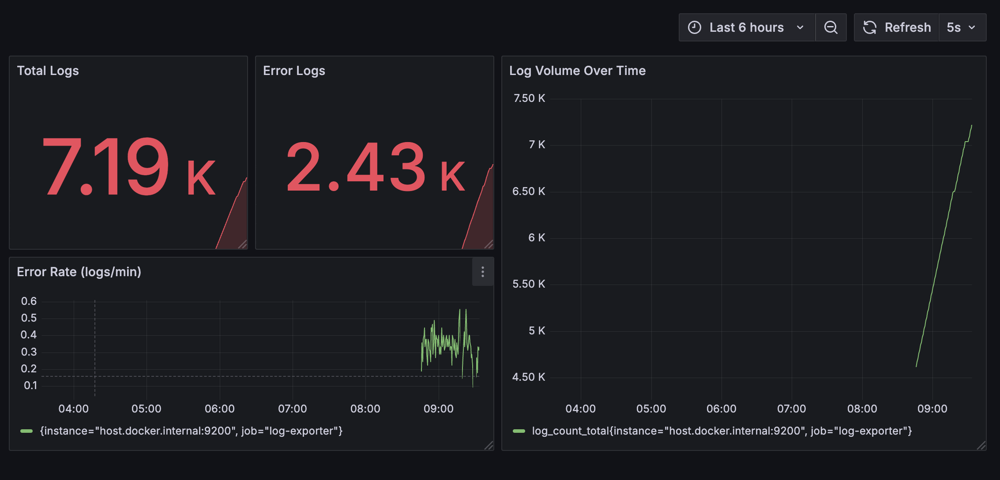

# 🔍Log Monitoring Platform

Real-time log analytics platform using **MongoDB**, **Kafka**, **Prometheus**, **Grafana**,  via Python. Built for cloud-native observability and alerting.

---

## 📸 Dashboard Preview

  
*Live metrics with error counts, trends, and AI-powered anomaly scores*

---

## 🚀 Features

- ✅ Log ingestion via Kafka producers (simulated logs)
- 📦 Logs stored in MongoDB (`ai_logs.logs`)
- 📈 Custom Prometheus Exporters:
  - MongoDB log metrics
  - AI anomaly detection using Isolation Forest
- 📊 Grafana dashboards for:
  - Total logs, error logs
  - Error rate, anomaly score
- 🔔 Alerting on high anomaly scores or error spikes
- 🐳 Dockerized stack for local deployment

---

## 🧱 Architecture

```

Kafka → MongoDB ← Python Log Producer
↓
Python AI Exporter → Prometheus ← Grafana Dashboard

````

---

## 📦 Stack Overview

| Component     | Description                                |
|---------------|--------------------------------------------|
| MongoDB       | Log storage                                |
| Kafka         | Log transport                              |
| Python        | Log producers + AI model                   |
| Prometheus    | Scrapes metrics from exporters             |
| Grafana       | Dashboards + alerting                      |
| IsolationForest | AI model for anomaly detection           |

---

## ⚙️ Getting Started

### 1. 🐳 Run with Docker Compose

```bash
docker-compose up -d
````

Make sure:

* MongoDB is accessible
* Prometheus scrapes both `9200` (log exporter) and `9201` (AI)

---

### 2. 📤 Start Log Producer

```bash
python log_producer.py
```

This sends fake logs to Kafka → stored in MongoDB.

---

### 3. 🤖 Start AI Anomaly Exporter

```bash
python ai_anomaly_detector.py
```

Exposes `/metrics` on `http://localhost:9201` for Prometheus.

---

## 📊 Prometheus Metrics Exposed

| Metric Name         | Description                       |
| ------------------- | --------------------------------- |
| `log_count_total`   | Total logs ingested               |
| `log_error_total`   | Total error logs                  |
| `log_anomaly_score` | AI-calculated anomaly score (0–1) |

---

## 📈 Grafana Panels (Suggestions)

* Stat Panel: Total logs
* Stat Panel: Error logs
* Time Series: Error rate
* Gauge: `log_anomaly_score`
* Bar Chart: Logs by service (if tagged)

---

## 🧠 AI Model Details

* Uses `IsolationForest` from `scikit-learn`
* Analyzes last 100 MongoDB log entries
* Calculates outlier score based on:

  * Timestamps
  * Log levels (error/info)
* Feeds score to Prometheus via `prometheus_client`

---

## 🛡 Security & Access (Optional)

* RBAC for Grafana dashboards
* OAuth login support (GitHub, Google)
* Encrypted MongoDB access (TLS)

---

## 📁 Directory Structure

```
.
├── ai_anomaly_detector.py
├── log_producer.py
├── docker-compose.yml
├── prometheus.yml
├── grafana/
│   └── dashboard.json
├── assets/
│   └── grafana_dashboard.png
└── README.md
```

---

## 📬 Contribute

Have ideas or want to contribute anomaly models (BERT logs, LSTM)?
Open a PR or connect via [LinkedIn](https://www.linkedin.com/in/saksham-goyal-ab3a1817b/)

---

## 🧠 Credits

Built by Saksham Goyal
Email: [sakshamgoyal1974@gmail.com](mailto:sakshamgoyal1974@gmail.com)
GitHub: [sakshamgoyal01](https://github.com/sakshamgoyal01)

---

## 📘 License

MIT License – feel free to fork and extend.

```

---

## 📌 Next Steps

### ✅ You Should:
1. Save/export a screenshot of your Grafana dashboard
2. Place it inside `assets/grafana_dashboard.png`
3. Save this `README.md` at your project root
4. Push to GitHub 🚀

---

Want me to generate a `docker-compose.yml` + sample Prometheus config + folders as ZIP too?

Let me know — we can wrap this into a deployable repo in <10 mins.
```
